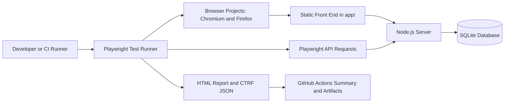

# Playwright Automation Framework Portfolio

[](https://github.com/Nick-25/playwright-automation-framework/actions/workflows/playwright.yml)
[](https://playwright.dev/)
[](https://www.typescriptlang.org/)
[](https://nodejs.org/)
[](LICENSE)

## Executive Summary

Playwright Automation Framework Portfolio is a production-style framework that demonstrates how modern QA automation can be designed, executed, reported, and maintained across UI and API layers.

The repository includes a local full-stack application, a Playwright Test automation suite, Page Object Model abstractions, API coverage, SQLite-backed state, GitHub Actions CI, Playwright HTML artifacts, and CTRF reporting. It is structured to show senior-level automation practices rather than isolated test snippets.

## Overview

This project provides a controlled application under test and a full-stack Playwright automation framework around it. The app includes authentication, protected routes, dashboard metrics, profile data, task management workflows, role-based API behavior, and persistent local data.

For deeper documentation, see [`docs/application-overview.md`](docs/application-overview.md) and [`docs/architecture.md`](docs/architecture.md).

## What This Demonstrates

- Playwright Test architecture for browser and API automation
- Page Object Model design for maintainable UI workflows
- Authentication coverage across cookies, JWTs, and local browser state
- Role-based authorization validation for user and admin flows
- API automation for login, user management, tasks, pagination, and negative paths
- Accessibility smoke testing with `@axe-core/playwright`
- Visual regression smoke testing with Playwright screenshots
- Cross-browser execution with Chromium and Firefox projects
- Playwright `webServer` orchestration for reliable local test startup
- SQLite-backed data persistence and seeded records
- CI execution through GitHub Actions
- Standardized reporting with Playwright HTML output and CTRF JSON
- Repository hygiene through CODEOWNERS, PR templates, Dependabot, and scoped workflow permissions

## Business Value

This framework shows how an automation solution can reduce release risk, improve regression confidence, and create actionable feedback for engineering teams.

- Validates critical user journeys at the browser layer
- Exercises service behavior directly through API tests
- Catches authorization and data-scope defects earlier in the delivery cycle
- Produces CI artifacts that support fast triage
- Uses maintainable abstractions so test growth does not create unnecessary maintenance cost
- Demonstrates how local application state can support repeatable automated validation

## Consulting Relevance

The project is representative of work commonly needed in QA automation consulting and modernization programs.

- **Selenium to Playwright migrations:** Demonstrates how legacy browser automation patterns can be modernized with Playwright fixtures, auto-waiting, parallel execution, trace capture, and multi-browser projects.
- **Playwright implementation:** Shows a practical framework baseline with page objects, shared fixtures, API helpers, test data patterns, and local app orchestration.
- **CI/CD integration:** Includes a GitHub Actions workflow that installs dependencies, runs tests, uploads artifacts, and publishes machine-readable test results.
- **API automation:** Covers authentication, authorization, user management, task workflows, pagination, validation, and negative-path scenarios through direct API requests.
- **Accessibility testing:** Includes UI validation patterns, `aria-invalid` assertions, and an axe-powered smoke suite for core public and authenticated pages.
- **Framework modernization:** Provides a compact example of replacing brittle, UI-only regression coverage with a layered automation strategy spanning UI, API, reporting, and CI.

## Architecture Diagram



Detailed architecture notes are available in [`docs/architecture.md`](docs/architecture.md), including the application layer, page objects, tests, fixtures, utilities, CI/CD, and reporting strategy.

## Project Structure

```text
.
|-- app/                         Static front end for the application under test
|-- data/                        Local SQLite database location
|-- docs/                        Supplemental project and application documentation
|   |-- architecture.md          Framework architecture and maintainability notes
|   |-- application-overview.md  Application behavior and test coverage overview
|   `-- images/                  Real screenshot captures, when added
|-- scripts/                     Supporting project scripts
|-- tests/
|   |-- fixtures/                Shared Playwright fixtures and seeded users
|   |-- helpers/                 Authentication and test support helpers
|   |-- pages/                   Page Object Model classes
|   |-- *.spec.ts                Browser and API test specifications
|   `-- README.md                Test-suite usage notes
|-- .github/
|   |-- workflows/playwright.yml CI pipeline for build, test, and reporting
|   |-- CODEOWNERS               Repository ownership
|   `-- dependabot.yml           Dependency update configuration
|-- playwright.config.ts         Playwright projects, reporters, and webServer setup
|-- server.js                    Local Node.js application and API server
|-- postman_collection.json      API collection for manual API exploration
|-- package.json                 Node scripts and dependencies
|-- LICENSE                      MIT license
`-- README.md                    Portfolio and framework overview
```

## Technology Stack

| Area | Technology |
| --- | --- |
| Test runner | Playwright Test |
| Language | TypeScript |
| Runtime | Node.js |
| Accessibility | `@axe-core/playwright` |
| Visual testing | Playwright screenshot assertions |
| Application server | Node.js HTTP server |
| Data store | SQLite via `better-sqlite3` |
| Browser coverage | Chromium and Firefox |
| Test design | Page Object Model, fixtures, API helpers |
| Reporting | Playwright HTML report, CTRF JSON, GitHub Actions summary |
| CI/CD | GitHub Actions |
| API exploration | Postman collection |

## CI/CD Overview

The GitHub Actions workflow runs on pushes and pull requests to `master`.

1. `Build App` installs dependencies and runs `npm run build --if-present`.
2. `Run Playwright Tests` installs Playwright browsers and executes `npm test`.
3. `Publish Test Report` downloads the CTRF artifact and publishes the test report into the GitHub Actions summary.

The CI pipeline produces:

- `playwright-report/` for the Playwright HTML report
- `test-results/` for traces, screenshots, videos, and attachments when generated
- `ctrf/ctrf-report.json` for standardized test reporting

## Reporting Overview

The framework uses multiple reporting outputs so results are useful to both engineers and delivery stakeholders.

- Playwright HTML report supports local investigation, trace review, and test-level debugging.
- CTRF JSON provides a standardized machine-readable report format.
- `ctrf-io/github-test-reporter` publishes pass/fail, flaky, skipped, retry, duration, and detailed test-result sections in GitHub Actions.
- Uploaded artifacts preserve test evidence for post-run triage.

## Screenshots

Screenshots should be real project captures only. The login and dashboard images below were captured from the local application; CI and report screenshots remain listed as placeholders until they can be captured from actual GitHub Actions or Playwright report output.

| Area | Placeholder path | Purpose |
| --- | --- | --- |
| Login page | `docs/images/login-page.png` | Captured from the local application |
| Dashboard | `docs/images/dashboard.png` | Captured from an authenticated local dashboard |
| GitHub Actions run | `docs/images/github-actions-run.png` | Show CI execution and workflow status |
| Playwright HTML report | `docs/images/playwright-html-report.png` | Show the local/debuggable Playwright report |
| Test results | `docs/images/test-results.png` | Show summarized pass/fail and reporting output |

### Login Page


### Dashboard


## Lessons Learned

- **Framework maintainability:** Page objects, fixtures, and focused smoke specs keep selectors, setup, and repeated user actions out of specs, making the suite easier to extend as workflows change.
- **Flaky test reduction:** Playwright auto-waiting, API-driven setup, stable seeded users, and targeted cleanup reduce timing sensitivity and state leakage.
- **Reporting strategy:** Pairing Playwright HTML reports with CTRF JSON and GitHub Actions summaries gives both engineers and stakeholders useful views of the same execution.
- **Test organization:** Splitting UI workflows, API coverage, fixtures, helpers, and page objects keeps the framework readable while still demonstrating full-stack validation.

## Local Execution

```powershell
nvm use
npm install
npx playwright install
npm test
```

The app runs at `http://127.0.0.1:3000`.

Playwright starts the app automatically through the `webServer` configuration when `npm test` runs. Use `npm run start` only when you want to inspect the application manually.

Useful Playwright commands:

```powershell
npm run test:headed
npm run test:a11y
npm run test:visual
npm run test:ui
npm run test:debug
npm run report
```

Use Node.js `20.19.0` or newer. The repository includes `.nvmrc`, and `package.json` declares the same runtime expectation through `engines`.

The accessibility smoke suite lives in `tests/accessibility.spec.ts` and can be run independently with:

```powershell
npm run test:a11y
```

It scans public entry points and an authenticated task workflow with WCAG 2.0/2.1 A and AA axe rules. The same spec is included in the full `npm test` run.

The visual regression smoke suite lives in `tests/visual-regression.spec.ts` and can be run with:

```powershell
npm run test:visual
```

Update visual baselines intentionally with:

```powershell
npx playwright test tests/visual-regression.spec.ts --project=chromium --update-snapshots
```

## Docker Execution

Docker support is included for consistent local and CI-style execution:

```powershell
docker build -t playwright-automation-framework .
docker run --rm playwright-automation-framework
```

Or with Docker Compose:

```powershell
docker compose up --build
```

The compose file mounts `playwright-report/`, `test-results/`, and `ctrf/` so reports are available on the host after container execution.

## Local Data

Users and tasks are stored in a local SQLite database at `data/app.db`. The database is created and seeded automatically when the server starts.

The database file is ignored by Git, so API-created users and tasks persist on your machine across server restarts but are not pushed to GitHub.

To reset local data, stop the server and delete `data/app.db`. The next server start recreates the database with seeded users and tasks.

API tests use shared cleanup helpers in `tests/helpers/api.ts` to remove durable users and tasks created during a run. This keeps local SQLite state from accumulating records across repeated executions.

## API and Postman Flow

The repository includes `postman_collection.json` for manual API exploration against the local server.

### Seeded Users

| Email | Password | Access |
| --- | --- | --- |
| `nick@example.com` | `nick-123` | user |
| `ada@example.com` | `lovelace-123` | user |
| `grace@example.com` | `hopper-123` | user |
| `admin@example.com` | `admin-123` | admin |

### Authentication

Log in first. The response includes a JWT token and the browser receives a 4-hour `session_token` cookie.

```http
POST http://127.0.0.1:3000/api/login
Content-Type: application/json

{
  "email": "admin@example.com",
  "password": "admin-123"
}
```

Use the returned token for protected API calls:

```http
Authorization: Bearer YOUR_TOKEN_HERE
```

For Postman convenience, you can mint a token with a local signing key instead of logging in through the UI. The default local key is `local-postman-key`.

```http
POST http://127.0.0.1:3000/api/dev-token
x-signing-key: local-postman-key
Content-Type: application/json

{
  "email": "admin@example.com",
  "expiresInHours": 48
}
```

`expiresInHours` is optional. Dev tokens default to 24 hours and are capped at 7 days. For local Postman testing, use `"expiresInHours": "never"` to create a non-expiring token.

Tokens remain valid after server restarts as long as `JWT_SECRET` stays the same and the token has not expired. Non-expiring dev tokens remain valid until you change `JWT_SECRET` or delete the user. The default local JWT secret is stable for this portfolio framework, but you can set your own:

```powershell
$env:JWT_SECRET="your-local-jwt-secret"
npm run start
```

### Core API Endpoints

| Endpoint | Purpose |
| --- | --- |
| `POST /api/login` | Authenticate and issue a JWT |
| `POST /api/logout` | Clear the browser session cookie |
| `GET /api/session` | Restore the current session |
| `GET /api/profile` | Return the signed-in user's profile |
| `GET /api/dashboard` | Return dashboard metrics |
| `GET /api/user-info` | Return scoped user data |
| `POST /api/users` | Create a user, admin token required |
| `DELETE /api/users/:id` | Delete a user, admin token required |
| `GET /api/tasks` | Return assigned tasks with filters and pagination |
| `POST /api/tasks` | Create a task |
| `PATCH /api/tasks/:id/complete` | Mark an authorized task complete |
| `DELETE /api/tasks/:id` | Delete an authorized task |

## Repository Protection

This public portfolio repository includes repository-side guardrails:

- `.github/CODEOWNERS` assigns ownership to `@Nick-25`
- `.github/pull_request_template.md` documents PR validation expectations
- `CONTRIBUTING.md` asks contributors to use pull requests instead of direct pushes to `master`
- `SECURITY.md` gives a lightweight vulnerability reporting policy
- `.github/dependabot.yml` keeps npm and GitHub Actions dependencies current
- The Playwright workflow uses scoped GitHub token permissions

For full protection, enable a GitHub branch protection rule or ruleset for `master` that requires pull requests, CODEOWNER review, and passing status checks before merge.

## Future Enhancements

- Expand accessibility coverage beyond smoke checks with keyboard-navigation scenarios
- Expand visual regression coverage beyond smoke baselines for key workflow states
- Add mobile viewport projects for responsive validation
- Introduce test data factories for larger API and UI scenarios
- Add contract-style validation for API response schemas
- Publish test trend data across CI runs
