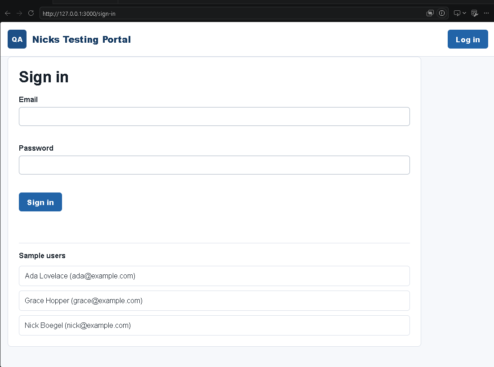
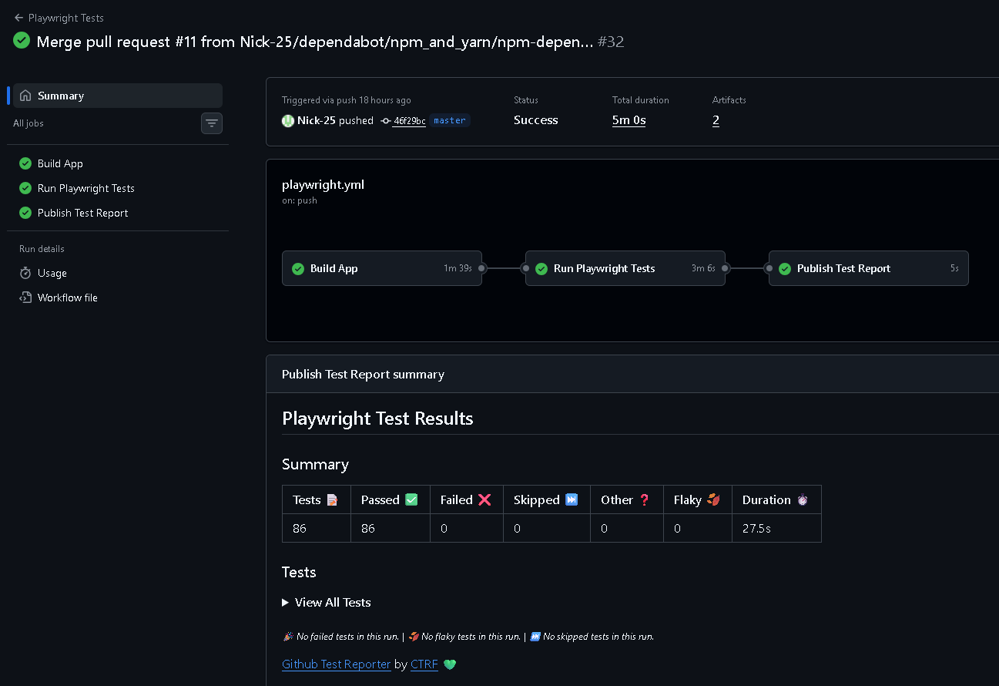
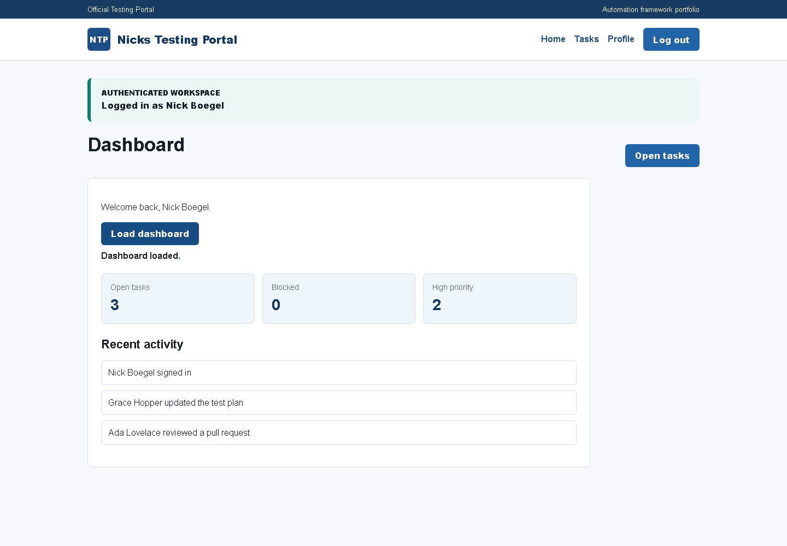
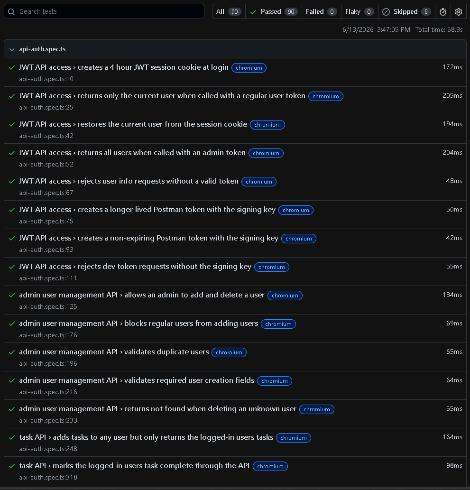
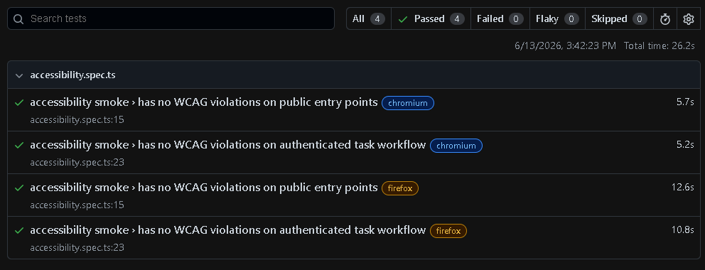
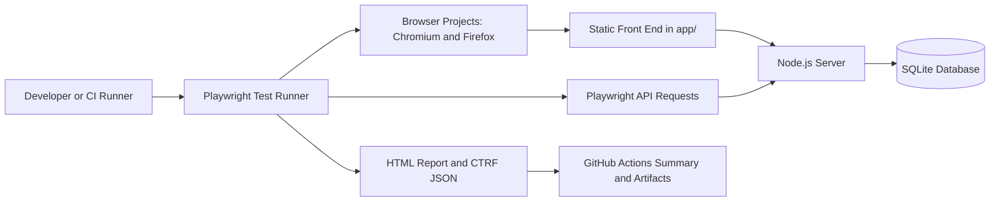

# Playwright Automation Framework Portfolio

[](https://github.com/Nick-25/playwright-automation-framework/actions/workflows/playwright.yml)
[](https://playwright.dev/)
[](https://www.typescriptlang.org/)
[](https://nodejs.org/)
[](LICENSE)

## Executive Summary

Playwright Automation Framework Portfolio is a production-style framework that demonstrates how modern QA automation can be designed, executed, reported, and maintained across UI and API layers.

The repository includes a local full-stack application, a Playwright Test automation suite, Page Object Model abstractions, API coverage, SQLite-backed state, GitHub Actions CI, Playwright HTML artifacts, and CTRF reporting. It is structured to show senior-level automation practices rather than isolated test snippets.

## Key Capabilities

- UI and API automation coverage across browser workflows, authentication, authorization, task management, user management, pagination, and negative paths
- 48 declared Playwright test cases across 2 configured desktop browser projects, producing 96 listed project/test combinations
- Chromium and Firefox browser execution through Playwright projects
- Accessibility smoke testing with `@axe-core/playwright`
- Visual regression smoke testing with Chromium screenshot baselines
- GitHub Actions CI/CD integration with build, test, artifact upload, and report publishing jobs
- Playwright HTML and CTRF JSON reporting
- Docker and Docker Compose execution support
- Local application under test with Node.js, static front end, JWT sessions, protected routes, and SQLite persistence
- Maintainable test architecture using Page Object Model classes, fixtures, and shared API/auth helpers

## Screenshots

These are real captures from the framework, grouped to show the app experience, CI execution, and generated test evidence.

| Application | Automation Evidence |
| --- | --- |
| <br>**Login Page** | <br>**GitHub Actions Run** |
| <br>**Dashboard** | <br>**Playwright HTML Report** |
|  | <br>**Accessibility Test** |

## Why This Project Exists

This project exists to demonstrate production-style Playwright architecture in a compact, reviewable portfolio codebase.

- Showcase UI, API, accessibility, visual, and CI testing in one coherent framework
- Provide a realistic automation portfolio project with a live local application under test
- Demonstrate maintainable automation patterns such as page objects, fixtures, API helpers, seeded data, and durable cleanup
- Model how an automation framework can create useful feedback for engineers, hiring managers, and consulting clients

## How to Review This Project

- **Recruiters:** Start with Key Capabilities, Screenshots, and Business Value for a quick view of the portfolio scope.
- **Hiring managers:** Review What This Demonstrates, Consulting Relevance, Architecture Diagram, and Lessons Learned to evaluate test strategy and maintainability.
- **Engineers:** Inspect `tests/`, `playwright.config.ts`, `server.js`, and the docs links for implementation depth.
- **Consulting clients:** Focus on CI/CD and Reporting, Docker Execution, and the reference docs to see how the framework supports repeatable delivery workflows.

## Overview

This project provides a controlled application under test and a full-stack Playwright automation framework around it. The app includes authentication, protected routes, dashboard metrics, profile data, task management workflows, role-based API behavior, and persistent local data.

For deeper documentation, see [`docs/application-overview.md`](docs/application-overview.md), [`docs/architecture.md`](docs/architecture.md), [`docs/local-data.md`](docs/local-data.md), [`docs/api-reference.md`](docs/api-reference.md), and [`docs/postman-usage.md`](docs/postman-usage.md).

## What This Demonstrates

- Playwright Test architecture for browser and API automation
- Page Object Model design for maintainable UI workflows
- Authentication coverage across cookies, JWTs, and local browser state
- Role-based authorization validation for user and admin flows
- API automation for login, user management, tasks, pagination, and negative paths
- Accessibility smoke testing with `@axe-core/playwright`
- Visual regression smoke testing with Playwright screenshots
- Cross-browser execution with Chromium and Firefox projects
- Playwright `webServer` orchestration for reliable local test startup
- SQLite-backed data persistence and seeded records
- CI execution through GitHub Actions
- Standardized reporting with Playwright HTML output and CTRF JSON
- Repository hygiene through CODEOWNERS, PR templates, Dependabot, and scoped workflow permissions

## Business Value

This framework shows how an automation solution can reduce release risk, improve regression confidence, and create actionable feedback for engineering teams.

- Validates critical user journeys at the browser layer
- Exercises service behavior directly through API tests
- Catches authorization and data-scope defects earlier in the delivery cycle
- Produces CI artifacts that support fast triage
- Uses maintainable abstractions so test growth does not create unnecessary maintenance cost
- Demonstrates how local application state can support repeatable automated validation

## Consulting Relevance

The project is representative of work commonly needed in QA automation consulting and modernization programs.

- **Selenium to Playwright migrations:** Demonstrates how legacy browser automation patterns can be modernized with Playwright fixtures, auto-waiting, parallel execution, trace capture, and multi-browser projects.
- **Playwright implementation:** Shows a practical framework baseline with page objects, shared fixtures, API helpers, test data patterns, and local app orchestration.
- **CI/CD integration:** Includes a GitHub Actions workflow that installs dependencies, runs tests, uploads artifacts, and publishes machine-readable test results.
- **API automation:** Covers authentication, authorization, user management, task workflows, pagination, validation, and negative-path scenarios through direct API requests.
- **Accessibility testing:** Includes UI validation patterns, `aria-invalid` assertions, and an axe-powered smoke suite for core public and authenticated pages.
- **Framework modernization:** Provides a compact example of replacing brittle, UI-only regression coverage with a layered automation strategy spanning UI, API, reporting, and CI.

## Architecture Diagram



Detailed architecture notes are available in [`docs/architecture.md`](docs/architecture.md), including the application layer, page objects, tests, fixtures, utilities, CI/CD, and reporting strategy.

## Project Structure

```text
.
|-- app/                         Static front end for the application under test
|-- data/                        Local SQLite database location
|-- docs/                        Supplemental project and application documentation
|   |-- api-reference.md         API endpoints and authentication details
|   |-- application-overview.md  Application behavior and test coverage overview
|   |-- architecture.md          Framework architecture and maintainability notes
|   |-- local-data.md            SQLite persistence, seeded data, and cleanup notes
|   |-- postman-usage.md         Manual API exploration with Postman
|   `-- images/                  Real screenshot captures
|-- scripts/                     Supporting project scripts
|-- tests/
|   |-- fixtures/                Shared Playwright fixtures and seeded users
|   |-- helpers/                 Authentication and test support helpers
|   |-- pages/                   Page Object Model classes
|   |-- *.spec.ts                Browser and API test specifications
|   `-- README.md                Test-suite usage notes
|-- .github/
|   |-- workflows/playwright.yml CI pipeline for build, test, and reporting
|   |-- CODEOWNERS               Repository ownership
|   `-- dependabot.yml           Dependency update configuration
|-- playwright.config.ts         Playwright projects, reporters, and webServer setup
|-- server.js                    Local Node.js application and API server
|-- postman_collection.json      API collection for manual API exploration
|-- package.json                 Node scripts and dependencies
|-- LICENSE                      MIT license
`-- README.md                    Portfolio and framework overview
```

## Technology Stack

| Area | Technology |
| --- | --- |
| Test runner | Playwright Test |
| Language | TypeScript |
| Runtime | Node.js |
| Accessibility | `@axe-core/playwright` |
| Visual testing | Playwright screenshot assertions |
| Application server | Node.js HTTP server |
| Data store | SQLite via `better-sqlite3` |
| Browser coverage | Chromium and Firefox |
| Test design | Page Object Model, fixtures, API helpers |
| Reporting | Playwright HTML report, CTRF JSON, GitHub Actions summary |
| CI/CD | GitHub Actions |
| API exploration | Postman collection |

## CI/CD and Reporting

The GitHub Actions workflow runs on pushes and pull requests to `master`.

1. `Build App` installs dependencies and runs `npm run build --if-present`.
2. `Run Playwright Tests` installs Playwright browsers, executes `npm test`, and uploads artifacts.
3. `Publish Test Report` downloads the CTRF artifact and publishes the test report into the GitHub Actions summary.

The framework produces multiple reporting outputs:

- Playwright HTML report for local investigation, trace review, and test-level debugging
- `test-results/` artifacts for traces, screenshots, videos, and attachments when generated
- `ctrf/ctrf-report.json` for standardized machine-readable reporting
- GitHub Actions summary output through `ctrf-io/github-test-reporter`

## Lessons Learned

- **Framework maintainability:** Page objects, fixtures, and focused smoke specs keep selectors, setup, and repeated user actions out of specs, making the suite easier to extend as workflows change.
- **Flaky test reduction:** Playwright auto-waiting, API-driven setup, stable seeded users, and targeted cleanup reduce timing sensitivity and state leakage.
- **Reporting strategy:** Pairing Playwright HTML reports with CTRF JSON and GitHub Actions summaries gives both engineers and stakeholders useful views of the same execution.
- **Test organization:** Splitting UI workflows, API coverage, fixtures, helpers, and page objects keeps the framework readable while still demonstrating full-stack validation.

## Local Execution

```powershell
nvm use
npm install
npx playwright install
npm test
```

The app runs at `http://127.0.0.1:3000`.

Playwright starts the app automatically through the `webServer` configuration when `npm test` runs. Use `npm run start` only when you want to inspect the application manually.

Useful Playwright commands:

```powershell
npm run test:headed
npm run test:a11y
npm run test:visual
npm run test:ui
npm run test:debug
npm run report
```

Use Node.js `20.19.0` or newer. The repository includes `.nvmrc`, and `package.json` declares the same runtime expectation through `engines`.

## Execution and Reference Docs

Detailed operational documentation lives under `docs/` so this README can stay focused on the framework story.

- [`docs/local-data.md`](docs/local-data.md) explains SQLite persistence, seeded users, seeded tasks, and cleanup behavior.
- [`docs/api-reference.md`](docs/api-reference.md) documents authentication, session behavior, authorization rules, and core API endpoints.
- [`docs/postman-usage.md`](docs/postman-usage.md) explains how to use `postman_collection.json` and local development tokens.
- [`tests/README.md`](tests/README.md) lists test-focused commands and suite notes.

## Docker Execution

Docker support is included for consistent local and CI-style execution:

```powershell
docker build -t playwright-automation-framework .
docker run --rm playwright-automation-framework
```

Or with Docker Compose:

```powershell
docker compose up --build
```

The compose file mounts `playwright-report/`, `test-results/`, and `ctrf/` so reports are available on the host after container execution.

## Repository Protection

This public portfolio repository includes repository-side guardrails:

- `.github/CODEOWNERS` assigns ownership to `@Nick-25`
- `.github/pull_request_template.md` documents PR validation expectations
- `CONTRIBUTING.md` asks contributors to use pull requests instead of direct pushes to `master`
- `SECURITY.md` gives a lightweight vulnerability reporting policy
- `.github/dependabot.yml` keeps npm and GitHub Actions dependencies current
- The Playwright workflow uses scoped GitHub token permissions

For full protection, enable a GitHub branch protection rule or ruleset for `master` that requires pull requests, CODEOWNER review, and passing status checks before merge.

## Future Enhancements

- Expand accessibility coverage beyond smoke checks with keyboard-navigation scenarios
- Expand visual regression coverage beyond smoke baselines for key workflow states
- Add mobile viewport projects for responsive validation
- Introduce test data factories for larger API and UI scenarios
- Add contract-style validation for API response schemas
- Publish test trend data across CI runs
